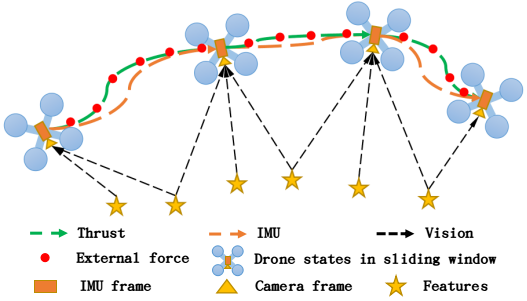

# VID-Fusion

### VID-Fusion: Robust Visual-Inertial-Dynamics Odometry for Accurate External Force Estimation

**Authors:** Ziming Ding , Tiankai Yang, Kunyi Zhang, Chao Xu, and [Fei Gao](https://ustfei.com/) from the [ZJU FAST Lab](http://www.zju-fast.com).

## 0. Overview

**VID-Fusion** is a work to estimate odometry and external force simultaneously by a tightly coupled Visual-Inertial-Dynamics state estimator for multirotors.  Just like [VIMO](https://github.com/uzh-rpg/vimo), we formulate a new factor in the optimization-based visual-inertial odometry system [VINS-Mono](https://github.com/HKUST-Aerial-Robotics/VINS-Mono). But we compare the dynamics model with the imu measurements to observe the external force and formulate the external force preintegration like imu preintegration. So, the thrust and external force can be added into the classical VIO system such as [VINS-Mono](https://github.com/HKUST-Aerial-Robotics/VINS-Mono) as a new factor.

**We present:** 

+ An external force preintegration term for back-end optimization.
+ A complete, robust, tightly-coupled Visual-Inertial-Dynamics state estimator.
+ Demonstration of robust and accurate external force and pose estimation.

 

Simultaneously estimating the external force and odometry within a sliding window.

**Related Paper**: [VID-Fusion: Robust Visual-Inertial-Dynamics Odometry for Accurate External Force Estimation](https://arxiv.org/pdf/2011.03993.pdf), Ziming Ding, Tiankai Yang, Kunyi Zhang, Chao Xu, and Fei Gao, *ICRA 2021*.

**Video Links:**  [bilibili](https://www.bilibili.com/video/BV1aZ4y1V7NF) or [Youtube](https://www.youtube.com/watch?v=d8NhYngzsF4).

## 1. Prerequisites

Our software is developed and only tested in Ubuntu 16.04, ROS Kinetic ([ROS Installation](http://wiki.ros.org/ROS/Installation)), OpenCV 3.3.1. 

Ceres Solver ([Ceres Installation](http://ceres-solver.org/installation.html)) is needed.

## 2. Build on ROS

```
cd your_catkin_ws/src
git clone git@github.com:ZJU-FAST-Lab/VID-Fusion.git
cd ..
catkin_make  --pkg quadrotor_msgs mav_msgs  # pre-build msg
catkin_make
```

## 3. Run in vid-dataset

```
cd your_catkin_ws
source ~/catkin_ws/devel/setup.bash
roslaunch vid_estimator vid_realworld.launch
roslaunch benchmark_publisher publish.launch #(option)
rosbag play YOUR_PATH_TO_DATASET
```

We provide the experiment data for testing, in which the [vid-experiment-dataset](https://zjufast-my.sharepoint.com/:f:/g/personal/tkyang_zjufast_onmicrosoft_com/Ejc8zhb5kRZPv3EinLOgEeUBskK3VofGBy_s2Dv196bLlg?e=2EfcuW) is in ros bag type.  The dataset provides two kinds of scenarios: **tarj8_with_gt** and **line_with_force_gt**.

* **tarj8_with_gt** is a dataset with odometry groundtruth. The drone flys with a payload.  

* **line_with_force_gt** is a dataset with external force groundtruth. The drone connects a force sensor via a elastic rope.

A new visual-inertial-dynamics dataset with richer scenarios is provided in  [VID-Dataset](https://github.com/ZJU-FAST-Lab/VID-Dataset).

The drone information should be provided in  ***VID-Fusion/config/experiments/drone.yaml***. It is noticed that you should use the proper parameter of the drone such as the **mass** and the **thrust_coefficient**, according to the related bag file.

As for  the **benchmark comparison**,  we naively edit the benchmark_publisher from [VINS-Mono](https://github.com/HKUST-Aerial-Robotics/VINS-Mono) to compare the estimated path, and add a external force visualization about the estimated force and the ground truth force. The ground truth data is in ***VID-Fusion/benchmark_publisher/data***.  You should switch path or force comparison by ***cur_kind*** in ***publish.launch*** (***0*** for path comparison and ***1*** for force comparison).

As for **model identification**, we collect the hovering data for identification. For the two data bags, **tarj8_with_gt** and **line_with_force_gt**, we also provide the hovering data for ***thrust_coefficient*** identification. After **system identification**, you should copy the ***thrust_coefficient*** result to ***VID-Fusion/config/experiments/drone.yaml***

```
roslaunch system_identification system_identify.launch 
rosbag play YOUR_PATH_TO_DATASET
#copy the thrust_coefficient result to VID-Fusion/config/experiments/drone.yaml
```

The **external force** is the resultant force except for rotor thrust and aircraft gravity. You can set ***force_wo_rotor_drag*** as *1* in config file to subtract the **rotor drag force** from the estimated force. And the related **drag coefficient** ***k_d_x*** and ***k_d_y*** should be given.

## 4. Acknowledgements

We replace the  model preintegration and dynamics factor from [VIMO](https://github.com/uzh-rpg/vimo), and formulate the proposed dynamics and external force factor atop the source code of [VIMO](https://github.com/uzh-rpg/vimo) and [VINS-Mono](https://github.com/HKUST-Aerial-Robotics/VINS-Mono). The [ceres solver](http://ceres-solver.org/) is used for back-end non-linear optimization, and [DBoW2](https://github.com/dorian3d/DBoW2)  for loop detection, and a generic [camera model](https://github.com/hengli/camodocal).  The monocular initialization, online extrinsic calibration, failure detection and recovery, loop detection, and global pose graph optimization, map merge, pose graph reuse, online temporal calibration, rolling shutter support are also from [VINS-Mono](https://github.com/HKUST-Aerial-Robotics/VINS-Mono).

## 5. Licence

The source code is released under [GPLv3](http://www.gnu.org/licenses/) license.

## 6. Maintaince

For any technical issues, please contact Ziming Ding ([zmding@zju.edu.cn](mailto:zm_ding@zju.edu.cn)) or Fei GAO ([fgaoaa@zju.edu.cn](mailto:fgaoaa@zju.edu.cn)).

For commercial inquiries, please contact Fei GAO ([fgaoaa@zju.edu.cn](mailto:fgaoaa@zju.edu.cn)).